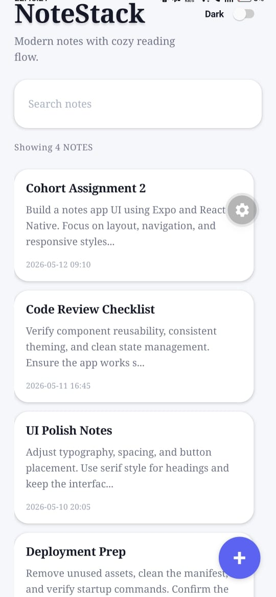
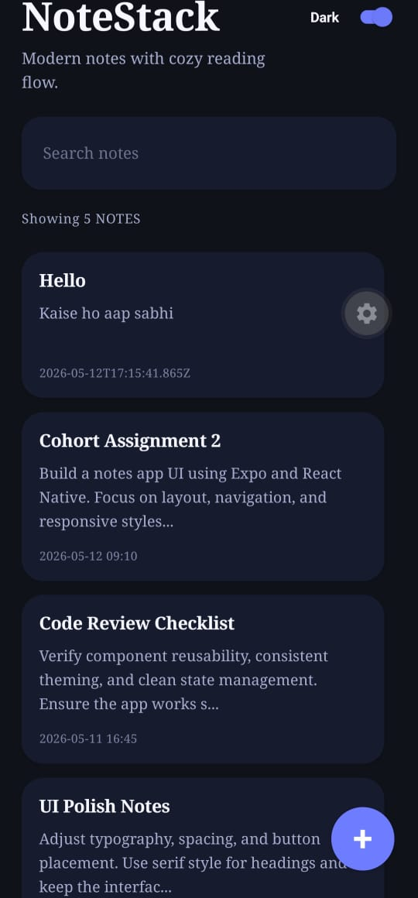
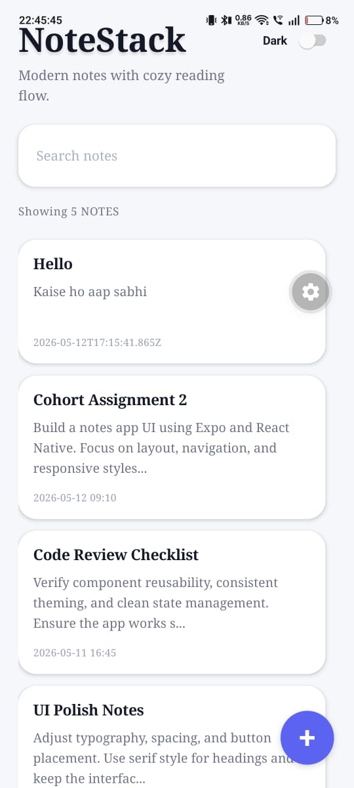
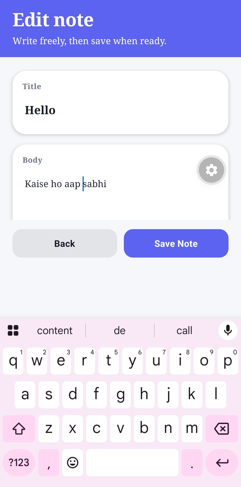

# 📝 Notes App UI (React Native Expo)

A modern, responsive, and visually polished Notes App UI built using **React Native (Expo SDK 55)**.  
This project is designed as part of a Mobile Development Cohort assignment to demonstrate clean UI design, reusable components, and proper React Native best practices.

---

## 🚀 Features

- 🗒️ Notes Listing Screen with FlatList
- 🔍 Real-time search/filter functionality
- 🌙 Dark / Light mode support using `useColorScheme()`
- ✍️ Beautiful Note Editor screen with ImageBackground header
- ⌨️ Keyboard-friendly layout using `KeyboardAvoidingView`
- 📱 Fully responsive design using `useWindowDimensions()`
- 🧩 Reusable components (NoteCard, ThemeToggle)
- 🎯 Clean UI with proper spacing, typography & shadows
- 👆 Smooth interactions using Pressable components

---

## 🛠️ Tech Stack

- React Native
- Expo SDK 55
- JavaScript (ES6+)
- JSX

---


# 📝 Notes App UI (React Native Expo)

A modern, responsive, and visually polished Notes App UI built using **React Native (Expo SDK 55)**.  
This project is designed as part of a Mobile Development Cohort assignment to demonstrate clean UI design, reusable components, and proper React Native best practices.

---

## 🚀 Features

- 🗒️ Notes Listing Screen with FlatList
- 🔍 Real-time search/filter functionality
- 🌙 Dark / Light mode support using `useColorScheme()`
- ✍️ Beautiful Note Editor screen with ImageBackground header
- ⌨️ Keyboard-friendly layout using `KeyboardAvoidingView`
- 📱 Fully responsive design using `useWindowDimensions()`
- 🧩 Reusable components (NoteCard, ThemeToggle)
- 🎯 Clean UI with proper spacing, typography & shadows
- 👆 Smooth interactions using Pressable components

---

## 🛠️ Tech Stack

- React Native
- Expo SDK 55
- JavaScript (ES6+)
- JSX

---


# 📝 Notes App UI (React Native Expo)

A modern, responsive, and visually polished Notes App UI built using **React Native (Expo SDK 55)**.  
This project is designed as part of a Mobile Development Cohort assignment to demonstrate clean UI design, reusable components, and proper React Native best practices.

---

## 🚀 Features

- 🗒️ Notes Listing Screen with FlatList
- 🔍 Real-time search/filter functionality
- 🌙 Dark / Light mode support using `useColorScheme()`
- ✍️ Beautiful Note Editor screen with ImageBackground header
- ⌨️ Keyboard-friendly layout using `KeyboardAvoidingView`
- 📱 Fully responsive design using `useWindowDimensions()`
- 🧩 Reusable components (NoteCard, ThemeToggle)
- 🎯 Clean UI with proper spacing, typography & shadows
- 👆 Smooth interactions using Pressable components

---

## 🛠️ Tech Stack

- React Native
- Expo SDK 55
- JavaScript (ES6+)
- JSX

```

## 📂 Project Structure
notes-app-ui/
│
├── App.jsx
├── assets/
├── src/
│ ├── components/
│ ├── screens/
│ ├── theme/
│ ├── data/
│ └── styles/
---

---
```


👉 isse niche ka content corrupt render hota hai

---


## 📸 Screenshots

### 🖥️ Notes Listing Screen


### 🌙 Dark Mode View


### ✍️ Note Editor Screen


### 📱 Responsive Tablet View


```
---

## ⚙️ Installation & Setup

1. Install dependencies
```bash
npm install
```
Start Expo server
-npm start
-Run on device
-Scan QR code using Expo Go app

---
👨‍💻 Author

Peeyush Tiwari

React Native Developer
Passionate about UI/UX and Frontend Engineering
